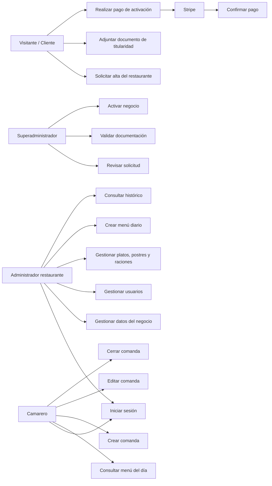
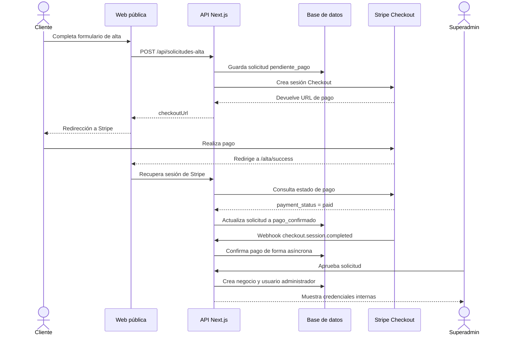
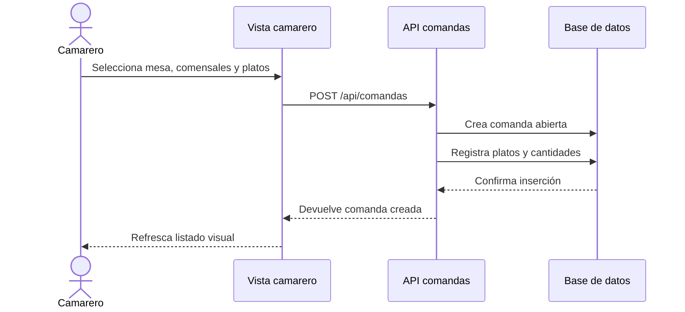
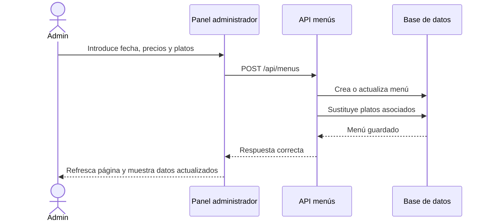
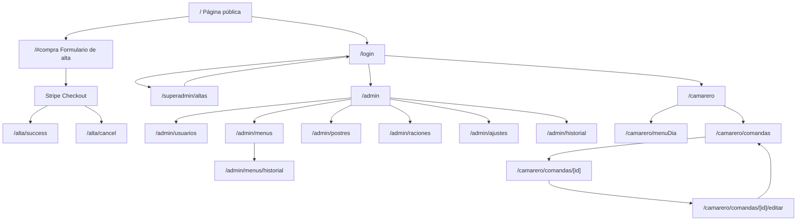

# Documentación académica de MenuManager

## 1. Introducción

MenuManager es una aplicación web orientada a la gestión diaria de restaurantes. El sistema permite registrar solicitudes de alta, validar documentación, confirmar el pago inicial mediante Stripe, activar negocios, gestionar usuarios internos, crear menús diarios y registrar comandas desde una interfaz adaptada a administración y sala.

El proyecto se estructura en tres perfiles principales:

- **Superadministrador**: valida solicitudes de alta, comprueba pagos y documentación, y activa nuevos restaurantes.
- **Administrador del restaurante**: gestiona los datos del negocio, usuarios, platos, menús, postres, raciones e histórico.
- **Camarero**: consulta el menú del día y crea, edita o cierra comandas.

El objetivo académico del sistema es demostrar un flujo completo de digitalización de un restaurante: desde el alta comercial hasta la operativa diaria.

## 2. Esquema de casos de uso

### 2.1 Actores

| Actor | Descripción |
|---|---|
| Visitante | Persona que accede a la web pública para solicitar el alta del restaurante. |
| Cliente/Restaurante | Negocio que completa el alta, realiza el pago y espera validación. |
| Superadministrador | Usuario interno de plataforma que revisa solicitudes y activa restaurantes. |
| Administrador | Responsable del restaurante una vez activado. |
| Camarero | Usuario operativo encargado de consultar menús y gestionar comandas. |
| Stripe | Pasarela externa encargada de procesar el pago de alta. |

### 2.2 Diagrama de casos de uso



### 2.3 Descripción resumida de casos de uso

| Código | Caso de uso | Actor principal | Resultado esperado |
|---|---|---|---|
| CU-01 | Solicitar alta | Visitante | Se registra una solicitud en estado pendiente de pago. |
| CU-02 | Subir documento | Visitante | Se guarda el documento asociado a la solicitud. |
| CU-03 | Pagar alta | Cliente/Stripe | Se crea una sesión de Stripe Checkout y se redirige al cliente. |
| CU-04 | Confirmar pago | Stripe/Sistema | La solicitud pasa a estado `pago_confirmado`. |
| CU-05 | Revisar solicitud | Superadministrador | Se visualizan datos, pago y documentación. |
| CU-06 | Aprobar solicitud | Superadministrador | Se crea el negocio y el usuario administrador inicial. |
| CU-07 | Rechazar solicitud | Superadministrador | La solicitud queda marcada como rechazada. |
| CU-08 | Iniciar sesión | Usuario interno | Se crea sesión y se redirige según el rol. |
| CU-09 | Gestionar negocio | Administrador | Se actualizan datos del restaurante. |
| CU-10 | Gestionar usuarios | Administrador | Se crean, editan o dan de baja usuarios. |
| CU-11 | Gestionar carta base | Administrador | Se crean o eliminan platos, postres y raciones. |
| CU-12 | Crear menú diario | Administrador | Se guarda el menú para una fecha concreta. |
| CU-13 | Consultar menú | Camarero | Se visualiza el menú disponible del día. |
| CU-14 | Crear comanda | Camarero | Se registra una comanda abierta. |
| CU-15 | Editar comanda | Camarero | Se modifican mesa, comensales o platos. |
| CU-16 | Cerrar comanda | Camarero | Se completa la comanda añadiendo postres y se marca como cerrada. |

## 3. Diagrama de secuencia

### 3.1 Alta, pago y validación del restaurante



### 3.2 Creación de una comanda



### 3.3 Creación de menú diario



## 4. Diagrama de navegación



## 5. Diseño de la interfaz

### 5.1 Criterios generales

La interfaz se ha diseñado con un enfoque profesional y operativo. El objetivo no es crear una página comercial compleja, sino una herramienta clara para restaurantes, con separación visual entre:

- página pública de alta,
- panel administrativo,
- panel de superadministración,
- vista móvil para camareros.

Se priorizan la lectura rápida, botones visibles, formularios claros y navegación directa.

### 5.2 Tipografía

El proyecto utiliza la fuente **Geist**, cargada desde Next.js mediante `next/font/google`.

| Uso | Fuente | Justificación |
|---|---|---|
| Texto general | Geist Sans | Buena legibilidad en pantallas y formularios. |
| Títulos | Geist Sans con peso alto | Aporta jerarquía visual sin perder sobriedad. |
| Códigos o etiquetas pequeñas | Estilo monoespaciado en algunos bloques | Mejora la lectura de datos técnicos o identificadores. |

### 5.3 Paleta de colores

La estética combina tonos oscuros para paneles de gestión con colores claros para tarjetas, formularios y zonas de lectura.

| Color aproximado | Uso | Intención |
|---|---|---|
| Verde/menta de acento | Botones principales, etiquetas y estados positivos | Asociar acción y confirmación. |
| Piedra/blanco roto | Fondos de tarjetas y paneles claros | Mejorar legibilidad. |
| Verde oscuro/negro suave | Fondos de paneles internos | Dar sensación profesional y de aplicación empresarial. |
| Ámbar | Avisos y estados pendientes | Señalar atención sin transmitir error grave. |
| Rojo suave | Mensajes de error | Identificar problemas de validación. |

### 5.4 Componentes visuales

| Componente | Uso |
|---|---|
| `glass-card` | Contenedores principales sobre fondos oscuros. |
| `paper-panel` | Paneles claros para contenido de lectura o tarjetas de información. |
| `primary-button` | Acciones principales como solicitar alta, acceder, guardar o aprobar. |
| `secondary-button` | Acciones secundarias como editar, volver o cancelar. |
| `field` | Campos de formulario con estilo homogéneo. |
| `pill` y `paper-tag` | Etiquetas de contexto para secciones y estados. |

### 5.5 Adaptación móvil

La vista de camarero está pensada para dispositivos de sala, PDA o móvil. Los elementos se muestran en columnas, con botones grandes y controles de cantidad visibles. Esto facilita el uso durante el servicio, donde la rapidez y la claridad son más importantes que una interfaz decorativa.

## 6. Plan de pruebas

Las pruebas se dividen en funcionales, validación de formularios, seguridad básica, navegación, roles y persistencia de datos.

### 6.1 Datos base de prueba

| Rol | CIF/NIF o ID negocio | ID usuario | PIN |
|---|---:|---:|---:|
| Superadministrador | 999 | 999 | 9999 |
| Administrador demo | 1 | 1 | 1234 |
| Camarero demo | 1 | 2 | 1111 |

### 6.2 Pruebas de autenticación

| Nº | Prueba | Datos introducidos | Resultado esperado | Resultado |
|---:|---|---|---|---|
| 1 | Login superadministrador correcto | Negocio `999`, usuario `999`, PIN `9999` | Acceso a `/superadmin/altas` | Pendiente de ejecución |
| 2 | Login administrador correcto | Negocio `1`, usuario `1`, PIN `1234` | Acceso a `/admin` | Pendiente de ejecución |
| 3 | Login camarero correcto | Negocio `1`, usuario `2`, PIN `1111` | Acceso a `/camarero` | Pendiente de ejecución |
| 4 | Login con CIF/NIF válido | CIF/NIF de negocio existente, usuario admin, PIN correcto | Acceso al panel correspondiente | Pendiente de ejecución |
| 5 | Login con PIN incorrecto | Usuario válido y PIN erróneo | Mensaje `PIN incorrecto` | Pendiente de ejecución |
| 6 | Login con usuario inexistente | Usuario `99999` | Mensaje de usuario no encontrado | Pendiente de ejecución |
| 7 | Login sin CIF/NIF o negocio | Campo vacío | Mensaje de campos obligatorios | Pendiente de ejecución |
| 8 | Login de negocio no activo | Credenciales de negocio pendiente | Acceso bloqueado | Pendiente de ejecución |
| 9 | Cierre de sesión | Pulsar cerrar sesión | Se elimina sesión y vuelve a login | Pendiente de ejecución |

### 6.3 Pruebas de alta y pago

| Nº | Prueba | Datos introducidos | Resultado esperado | Resultado |
|---:|---|---|---|---|
| 10 | Alta con datos completos | Nombre, CIF/NIF, contacto, email, teléfono, dirección, ciudad, PIN y documento | Solicitud creada y redirección a Stripe | Pendiente |
| 11 | Alta sin nombre | Nombre vacío | Error de datos obligatorios | Pendiente |
| 12 | Alta sin CIF/NIF | CIF/NIF vacío | Error de datos obligatorios | Pendiente |
| 13 | Alta sin documento | No adjuntar archivo | Error indicando documento obligatorio | Pendiente |
| 14 | Documento no permitido | Archivo `.txt` | Error de tipo de archivo | Pendiente |
| 15 | Documento superior a 5 MB | PDF/JPG/PNG mayor de 5 MB | Error de tamaño máximo | Pendiente |
| 16 | PIN inicial corto | PIN de 3 caracteres | Error de longitud mínima | Pendiente |
| 17 | Pago Stripe correcto | Tarjeta test `4242 4242 4242 4242` | Redirección a éxito y pago confirmado | Pendiente |
| 18 | Pago cancelado | Cancelar en Stripe | Redirección a `/alta/cancel` | Pendiente |
| 19 | Webhook de pago correcto | Evento `checkout.session.completed` | Solicitud marcada como `pago_confirmado` | Pendiente |
| 20 | Pago no confirmado | Sesión Stripe sin `paid` | Aviso de pago no completado | Pendiente |

### 6.4 Pruebas de superadministración

| Nº | Prueba | Datos introducidos | Resultado esperado | Resultado |
|---:|---|---|---|---|
| 21 | Ver listado de solicitudes | Entrar como superadmin | Se muestran altas ordenadas por fecha | Pendiente |
| 22 | Filtrar solicitudes pendientes | Pulsar filtro `Pago pendiente` | Solo se muestran solicitudes pendientes | Pendiente |
| 23 | Aprobar solicitud con pago confirmado | Solicitud en `pago_confirmado` | Se crea negocio y usuario admin | Pendiente |
| 24 | Aprobar solicitud sin pago | Solicitud `pendiente_pago` | Acción bloqueada | Pendiente |
| 25 | Rechazar solicitud | Pulsar rechazar | Solicitud queda `rechazada` | Pendiente |
| 26 | Ver documentación | Pulsar enlace de documento | Se abre el documento asociado | Pendiente |
| 27 | Recarga tras aprobar | Aprobar solicitud | La página se refresca y muestra estado actualizado | Pendiente |

### 6.5 Pruebas de administración del restaurante

| Nº | Prueba | Datos introducidos | Resultado esperado | Resultado |
|---:|---|---|---|---|
| 28 | Acceder al panel admin | Login como admin | Se muestra resumen del restaurante | Pendiente |
| 29 | Actualizar datos del negocio | Cambiar teléfono o dirección | Datos guardados y vista refrescada | Pendiente |
| 30 | Crear usuario camarero | Nombre, PIN y rol `camarero` | Usuario creado en listado | Pendiente |
| 31 | Crear usuario admin | Nombre, PIN y rol `admin` | Usuario creado en listado | Pendiente |
| 32 | Editar usuario | Cambiar teléfono o rol | Usuario actualizado | Pendiente |
| 33 | Dar de baja usuario | Pulsar eliminar | Usuario queda inactivo | Pendiente |
| 34 | Crear plato | Nombre, precio, ingredientes | Plato aparece en catálogo | Pendiente |
| 35 | Editar plato | Cambiar precio o nombre | Plato actualizado | Pendiente |
| 36 | Eliminar plato | Pulsar eliminar | Plato desaparece del catálogo | Pendiente |
| 37 | Carga rápida de platos | Varias líneas de texto | Se crean varios platos | Pendiente |
| 38 | Crear postre | Nombre y precio | Postre disponible | Pendiente |
| 39 | Crear ración | Nombre y precio | Ración disponible | Pendiente |

### 6.6 Pruebas de menú diario

| Nº | Prueba | Datos introducidos | Resultado esperado | Resultado |
|---:|---|---|---|---|
| 40 | Crear menú completo | Fecha, precios, primeros, segundos y postres | Menú guardado para la fecha | Pendiente |
| 41 | Crear menú sin platos | Fecha y precios sin platos | Error o menú sin opciones según validación | Pendiente |
| 42 | Actualizar menú existente | Cambiar platos de la misma fecha | Se sustituye el menú anterior | Pendiente |
| 43 | Consultar historial | Entrar en historial | Se muestran menús anteriores | Pendiente |
| 44 | Ver menú desde camarero | Entrar en `/camarero/menuDia` | Se muestra menú del día | Pendiente |
| 45 | Día sin menú | No existe menú para hoy | Mensaje de menú no cargado | Pendiente |

### 6.7 Pruebas de comandas

| Nº | Prueba | Datos introducidos | Resultado esperado | Resultado |
|---:|---|---|---|---|
| 46 | Crear comanda normal | Mesa, comensales y platos | Comanda abierta creada | Pendiente |
| 47 | Crear comanda sin platos | Mesa y comensales sin selección | Error de selección obligatoria | Pendiente |
| 48 | Crear comanda de empresa | Activar opción empresa | Comanda marcada como empresa | Pendiente |
| 49 | Editar comanda | Cambiar mesa o platos | Comanda actualizada | Pendiente |
| 50 | Ver detalle de comanda | Pulsar una comanda | Se muestra el resumen del pedido | Pendiente |
| 51 | Cerrar comanda con postre | Seleccionar postres y cerrar | Estado pasa a cerrada | Pendiente |
| 52 | Cerrar sin postre | Intentar cerrar sin selección | Error indicando selección obligatoria | Pendiente |
| 53 | Refresco tras crear comanda | Crear comanda | Listado actualizado visualmente | Pendiente |
| 54 | Refresco tras cerrar comanda | Cerrar comanda | Listado actualizado visualmente | Pendiente |

### 6.8 Pruebas de seguridad y permisos

| Nº | Prueba | Datos introducidos | Resultado esperado | Resultado |
|---:|---|---|---|---|
| 55 | Acceso a `/admin` sin sesión | Abrir URL directa | Redirección a `/login` | Pendiente |
| 56 | Acceso a `/superadmin/altas` como admin | Login admin y abrir URL | Redirección fuera del área superadmin | Pendiente |
| 57 | Acceso a `/camarero` como superadmin | Login superadmin y abrir URL | Acceso bloqueado o redirigido | Pendiente |
| 58 | API usuarios sin sesión | Llamada directa a API | Respuesta no autorizada | Pendiente |
| 59 | API comandas sin sesión | Llamada directa a API | Respuesta no autorizada | Pendiente |
| 60 | Documento no válido | Subida de archivo no permitido | Rechazo por tipo o tamaño | Pendiente |

## 7. Posibles mejoras futuras

| Mejora | Descripción | Prioridad |
|---|---|---|
| Email automático tras aprobación | Enviar al cliente las instrucciones de acceso cuando el superadministrador apruebe el alta. | Alta |
| Normalización avanzada de CIF/NIF | Guardar CIF/NIF en mayúsculas, sin espacios y con validación formal. | Alta |
| Almacenamiento privado de documentos | Mover documentos fuera de `public` y servirlos mediante API protegida. | Alta |
| Auditoría de acciones | Registrar quién aprueba, rechaza, crea usuarios o modifica menús. | Media |
| Tests automatizados | Añadir pruebas unitarias y end-to-end con Playwright o equivalente. | Media |
| Panel de soporte | Crear solicitudes de soporte asociadas al negocio. | Media |
| Facturación avanzada | Incorporar planes, facturas o pagos adicionales. | Media |
| Notificaciones internas | Avisar al superadministrador cuando llegue una solicitud pagada. | Media |
| Informes de ventas | Generar métricas por comandas, fechas, menús y tipos de plato. | Baja |
| Mejora de UX sin recarga completa | Sustituir `window.location.reload()` por actualización controlada de estado o invalidación de datos. | Media |
| Validación documental avanzada | Añadir estados de revisión documental y comentarios del superadministrador. | Media |
| Exportación de comandas | Generar PDF o CSV de comandas cerradas. | Baja |

## 8. Manual de instalación

### 8.1 Requisitos previos

Para ejecutar el proyecto es necesario disponer de:

- Node.js instalado.
- npm instalado.
- Base de datos compatible con la configuración del proyecto.
- Acceso a Stripe en modo test si se quiere probar el flujo real de pago.
- Editor de código recomendado: WebStorm o Visual Studio Code.

### 8.2 Descarga del proyecto

Situar el proyecto en una carpeta local, por ejemplo:

```bash
C:\Users\usuario\WebstormProjects\menu_manager
```

Entrar en la carpeta:

```bash
cd C:\Users\usuario\WebstormProjects\menu_manager
```

### 8.3 Instalación de dependencias

Ejecutar:

```bash
npm install
```

Este comando instala las dependencias definidas en `package.json`, entre ellas Next.js, React, Prisma, bcrypt y librerías auxiliares.

### 8.4 Configuración de variables de entorno

Crear o revisar el archivo `.env` en la raíz del proyecto.

Ejemplo orientativo:

```env
DATABASE_URL="mysql://root:@localhost:3306/menumanager"
DATABASE_HOST="localhost"
DATABASE_USER="root"
DATABASE_PASSWORD=""
DATABASE_NAME="menumanager"

PAYMENT_PROVIDER="stripe"
STRIPE_SECRET_KEY="sk_test_..."
STRIPE_WEBHOOK_SECRET="whsec_..."
STRIPE_AMOUNT_CENTS="9900"
```

Notas:

- `PAYMENT_PROVIDER="stripe"` activa el flujo real con Stripe.
- Si `PAYMENT_PROVIDER` tiene otro valor, se usará el flujo de pago de prueba.
- `STRIPE_SECRET_KEY` debe ser una clave de test de Stripe.
- `STRIPE_WEBHOOK_SECRET` es necesario para validar webhooks reales.
- `STRIPE_AMOUNT_CENTS="9900"` representa 99,00 EUR.

### 8.5 Preparación de base de datos

Aplicar migraciones:

```bash
npx prisma migrate dev
```

Generar cliente Prisma si fuera necesario:

```bash
npx prisma generate
```

Cargar datos iniciales:

```bash
npx prisma db seed
```

### 8.6 Ejecución en desarrollo

Arrancar el servidor:

```bash
npm run dev
```

Abrir la aplicación en:

```txt
http://localhost:3000
```

### 8.7 Compilación para producción

Ejecutar:

```bash
npm run build
```

Si la compilación finaliza correctamente, iniciar el servidor de producción:

```bash
npm run start
```

### 8.8 Configuración de Stripe para pruebas

Para probar el pago:

1. Acceder al panel de Stripe en modo test.
2. Usar una clave secreta de test en `STRIPE_SECRET_KEY`.
3. Configurar el webhook apuntando a:

```txt
/api/stripe/webhook
```

4. Guardar el secreto del webhook en `STRIPE_WEBHOOK_SECRET`.
5. Probar el pago con la tarjeta:

```txt
4242 4242 4242 4242
Caducidad: 12/34
CVC: 123
```

## 9. Manual de uso

### 9.1 Solicitud de alta del restaurante

1. Entrar en la página pública.
2. Pulsar **Solicitar alta**.
3. Rellenar los datos de empresa:
   - nombre del restaurante,
   - CIF/NIF,
   - persona de contacto,
   - teléfono,
   - correo electrónico,
   - número de locales,
   - PIN inicial del administrador,
   - dirección,
   - ciudad.
4. Adjuntar documento de titularidad.
5. Pulsar **Continuar con el pago**.
6. Completar el pago en Stripe.
7. Esperar la validación administrativa.

### 9.2 Acceso al sistema

1. Entrar en `/login`.
2. Introducir:
   - CIF/NIF de la empresa o ID interno del negocio,
   - ID de usuario,
   - PIN.
3. Pulsar **Acceder**.
4. El sistema redirige según el rol:
   - superadministrador: solicitudes de alta,
   - administrador: panel de administración,
   - camarero: panel operativo.

### 9.3 Uso del superadministrador

1. Acceder con credenciales de superadministrador.
2. Revisar las solicitudes disponibles.
3. Comprobar:
   - estado del pago,
   - datos fiscales,
   - documento de titularidad,
   - coherencia de la información.
4. Aprobar o rechazar la solicitud.
5. Al aprobar, el sistema crea:
   - negocio,
   - usuario administrador inicial.

### 9.4 Uso del administrador

Desde el panel de administración se puede:

- consultar resumen del día,
- modificar datos del restaurante,
- crear o editar usuarios,
- crear platos,
- crear postres,
- crear raciones,
- crear menú diario,
- consultar histórico.

Flujo recomendado:

1. Revisar datos del negocio.
2. Crear usuarios necesarios.
3. Registrar platos base.
4. Registrar postres y raciones.
5. Crear el menú del día.
6. Revisar que el menú aparece correctamente para camareros.

### 9.5 Uso del camarero

El camarero puede:

1. Consultar el menú del día.
2. Crear una comanda indicando:
   - mesa,
   - número de comensales,
   - si es empresa,
   - platos seleccionados.
3. Ver comandas abiertas.
4. Editar una comanda si es necesario.
5. Cerrar una comanda añadiendo postres.

### 9.6 Recomendaciones de uso

- Mantener actualizado el menú del día antes del servicio.
- Revisar los usuarios activos periódicamente.
- Dar de baja usuarios que ya no trabajen en el restaurante.
- Comprobar que las comandas se cierran correctamente al finalizar el servicio.
- Usar comentarios de alta para indicar necesidades especiales del negocio.

## 10. Conclusión

MenuManager presenta una solución completa para gestionar el alta y la operativa diaria de restaurantes. El sistema cubre registro, validación, pago, activación, administración interna y uso operativo en sala. Desde un punto de vista académico, integra autenticación por roles, persistencia con base de datos, formularios validados, pasarela de pago externa y separación clara entre áreas públicas, administrativas y operativas.
